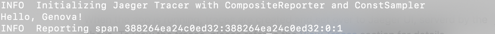
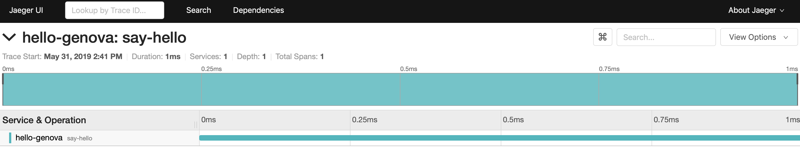

# OpenTraceHelloWorld
A hello-world app in NodeJS. Instrumented by Jaeger-Client, and deployed to AWS Lambda using Serverless framework.

**Problem Statement:** Need documentation and example hello-world app to instrument with Tracing.

**Acceptance Criteria:**
- Need a hello-world app repo that can be deployed with serverless framework to aws Lambda to help be a tutorial for instrumenting with opentracing ideally using typescript, but node is ok as well.
- Ensure the jaeger-client sends data to a running jaeger-docker instance via udp (in amgen case the endpoint will be provided, for your case you may need to run the docker image of jaeger)
- Serverless framework should assume VPC , not public facing, so you may need to adjust serverless.yml and ensure it’s setup right so that the hello-world lambda endpoint is private and the jaeger reporter config sends traces to private ip also

## Dev Step

- [x] Create the hello-world app instrumented by Jaeger
  - [x] [Create a hello-world frontend app in NodeJS](https://github.com/yurishkuro/opentracing-tutorial/tree/master/nodejs/lesson01)
  - [x] [Trace the app with Jaeger-Client](https://github.com/jaegertracing/jaeger-client-node)
  - [x] [Install Docker](https://docs.docker.com/v17.12/docker-for-mac/install/)
  - [x] [Run Docker backend for Jaeger](https://www.jaegertracing.io/docs/1.6/getting-started/#all-in-one-docker-image)
  - [x] Ensure the Jaeger-Client sends data to a running jaeger-docker instance via udp (in amgen case the endpoint will be provided, for your case you may need to run the docker image of jaeger) https://medium.com/velotio-perspectives/a-comprehensive-tutorial-to-implementing-opentracing-with-jaeger-a01752e1a8ce
- [ ] Create serverless template in the same directory of the Node app. Configure `handler.js` generated by serverless to chain the hello-world app with lambda endpoint. Reference: https://www.youtube.com/watch?v=oZP6rHglm98
- [ ] Deploy the hello-world app to AWS using serverless
- [ ] Configure serverless framework to assume VPC , not public facing, so you may need to adjust serverless.yml and ensure it’s setup right so that the hello-world lambda endpoint is private and the jaeger reporter config sends traces to private ip also
- [ ] Create document to instruct instrumenting the app via Jaeger

## Setup on MacBook

#### Prerequisites

- Install Node: download the [Node pre-built installer](https://nodejs.org/en/download/) for Macbook, then follow the installation steps
- [Install Docker](https://docs.docker.com/v17.12/docker-for-mac/install/)

#### Dependencies

In project directory:

- `jaeger-client`: `npm install --save jaeger-client`

#### Run

a) Run Jaeger backend as an all-in-one Docker image named `jaeger`:

```
$ docker run -d --name jaeger \
  -e COLLECTOR_ZIPKIN_HTTP_PORT=9411 \
  -p 5775:5775/udp \
  -p 6831:6831/udp \
  -p 6832:6832/udp \
  -p 5778:5778 \
  -p 16686:16686 \
  -p 14268:14268 \
  -p 9411:9411 \
  jaegertracing/all-in-one:1.6
  ```

Browse Jaeger UI via `http://localhost:16686` to verify the `jaeger` image was created successfuly:


Jaeger backend serves Jaeger UI for visualizing traces. Without it being set up, traces created in b) won't be visualizable, let alone further assessment and improvement of the app made easier via the visualization. [Read more](https://www.jaegertracing.io/docs/1.6/getting-started/#all-in-one-docker-image) to understand the docker-jaeger instance.

To reset the `jaeger` image, stop the Docker image then remove it via `Docker stop jaeger; Docker rm jaeger` in terminal.

b) Run the hello-world app with Node: `$ node hello.js Genova`



When the app is running, traces are created and sent over to Jaeger UI, serverd by the `jaeger` Docker image created above. To view the traces, please refer to the [View Traces](#view-traces) section for details.

_NOTE:_
- _`Genova` is customizable to any value._
- _a) and b) MUST be executed in the above order, to send the latest traces to Jaeger UI._

#### View Traces

In Jaeger UI, select `hello-genova` in `Jaeger UI/Find Traces/Services` then hit `Find Traces` to see the `hello-genova` trace:


Click the `hello-genova` trace to see span details:


